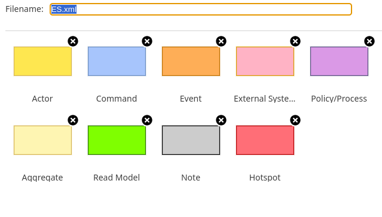
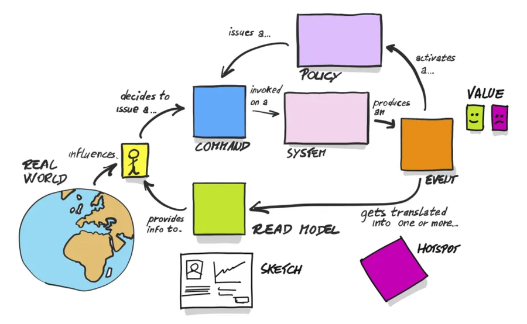
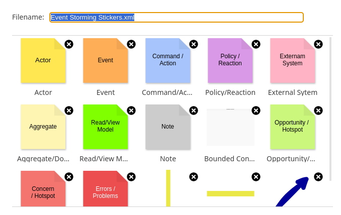

# My libs for drawio

In `base` libs that inspired this:

- https://github.com/josenaldo/event-storming-template
- https://github.com/bdavisx/drawio-templates/blob/master/EventStorming.xml

ES — block style with all needed in my Vision

ES Classic Colors — colors from base ES flow scheme

Event Stroming Stickers — adjusted stickers

